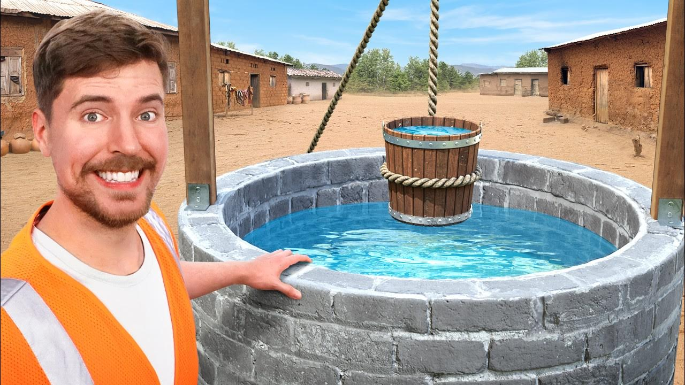

# Beast Philanthropy Tanzania Water Well Project

## Introduction

Located in Eastern Africa, Tanzania is the largest country in East Africa with a population of approximately 66 million people (2023 est.). Despite its size, Tanzania faces a significant challenge as around 26 million inhabitants lack direct access to clean water. The need to travel for kilometers to obtain this vital resource exacerbates the adverse consequences of water scarcity, impacting agriculture, health, and contributing to high infant mortality rates.

In response to these challenges, the Tanzanian government, NGOs, and individuals have initiated water well projects over the years. However, concerns persist regarding the effectiveness of these endeavors. This project aims to leverage machine learning and data visualization to identify potential issues with existing water well projects, forecast the success of new initiatives, and allocate funds strategically for maximum impact in areas requiring urgent intervention.

## Problem Statement

Philanthropist and YouTuber Jimmy Donaldson, known as 'Mr. Beast,' in collaboration with the UN-Habitat and 'Beast Philanthropy,' is initiating a mission to provide clean water access in Tanzania. Despite recent efforts, a significant portion of the population still lacks safe water access. The initiative aims to evaluate the distribution of wells in Tanzania and assess the functionality of water pumps in existing wells, categorizing them as functional, non-functional, or in need of repair.

As part of Beast Philanthropy's initiative, the task involves developing a classification model to predict the operational status of wells.

## Metric of Success

The model's success will be measured by achieving an accuracy of at least 70%.

## Objectives

### Primary Objective:
- Deliver accurate predictions regarding the operational status of wells.

### Specific Objectives:
- Determine the quality of water in Tanzania.
- Identify the top 5 installers of water wells in Tanzania.
- Analyze functionality status with respect to payment type.
- Assess the condition of waterpoint pumps based on age.
- Identify installers resulting in the most nonfunctional waterpoint pumps.
- Determine the most popular extraction type.

## Data Understanding

The target variable in this dataset is `status_group` with labels:
- `functional`: The waterpoint is operational, and no repairs are needed.
- `functional needs repair`: The waterpoint is operational but needs repairs.
- `non-functional`: The waterpoint is not operational.

Libraries used include pandas, etc.

## Exploratory Data Analysis (EDA)

EDA involves visualizing data distributions, identifying missing values, and analyzing correlations between features. It provides an initial understanding of the data's characteristics, guiding more in-depth analyses and modeling.

## Preprocessing

Data preprocessing was performed to handle outliers and prepare the data for regression, including model fitting.

## Classification Models

Various classification models such as KNN, Decision Tree, Dummy Model, Logistic Regression, Pipelines, Grid Search, Random Forest, and XGBClassifier were employed.

## Saving the Models
Once the machine learning model is trained and optimized, it's crucial to save the model for future use without retraining. In this project, we have implemented a model saving mechanism, pickle, to store the trained XGBClassifier. This ensures that the model can be easily loaded and deployed in production or for further analysis without the need to retrain.

## Conclusions

The top-performing model is the baseline XGBClassifier, demonstrating a training accuracy of 85.84% and a test accuracy of 82.09%. Minimal overfitting is observed, with a commendable cross-validation score of 0.819. This model's ability to generalize effectively to new data aligns with the predefined success criteria.

## Recommendations

1. Deploy the baseline XGBClassifier as the preferred model.
2. Prioritize repairing non-functional wells to avoid multiple concurrent problems.
3. Distribute wells strategically to prevent overpopulation in specific areas.
4. Utilize the predictive model to prioritize waterpoints according to needs.

## Next Steps

Integrate maintenance records to reflect repairs made to waterpoints, preventing repeated classification as needing repairs. Explore additional classifiers to prioritize maintenance for non-functional waterpoints.

## Contributor

- [Emmanuel Rono](https://github.com/marttech26)
